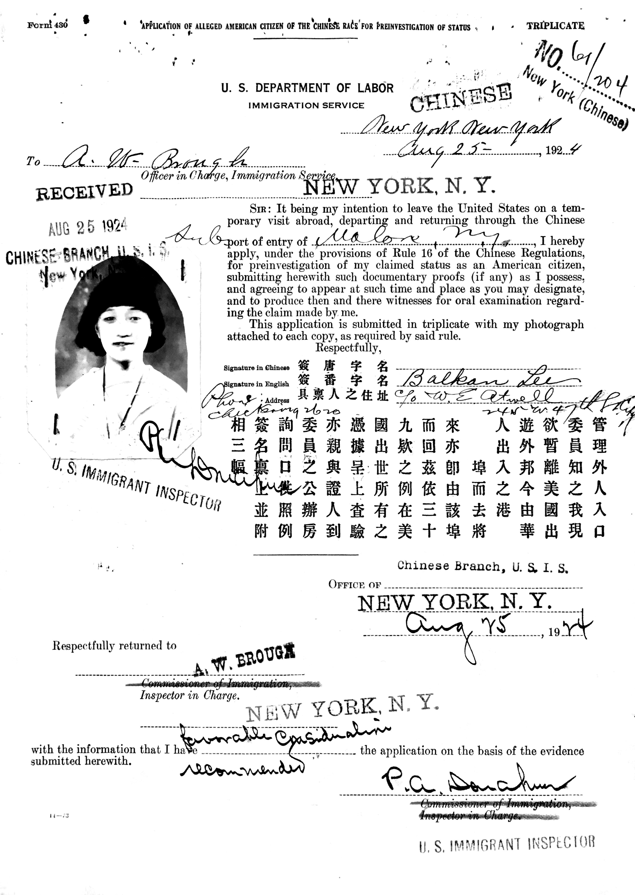

# **“Alternative Archives in Popular Entertainment Research:  The Chinese Exclusion Act Case Files”**

<h4 style="text-align: center;">Book Chapter, <em>Researching Popular Entertainment</em> (Rutledge)</h4>

This chapter invites historians of popular entertainment to look for sources in archives that might not be officially recognised as performing arts archives. I use the Chinese Exclusion Act Case Files at National Archives in San Bruno, Seattle, and New York City as an example. In nineteenth-century United States, while travel and communication technology facilitated the global circulation of entertainers, immigration laws restricted the entry of foreign performers. This tension is especially apparent in Chinese Exclusion Act Case Files, a collection of immigration records documenting the international mobility of popular entertainment and entry regulations for Chinese performers during the Chinese Exclusion Era. The Exclusion Act Case Files supplement the often-sparse popular entertainment archive with valuable information. Moreover, placing global mobility alongside immigration restriction, the collection highlights that not only restrictive immigration policies influenced what appeared in popular theatres, but most strikingly, popular entertainment affected how immigration law evolved and was implemented.

