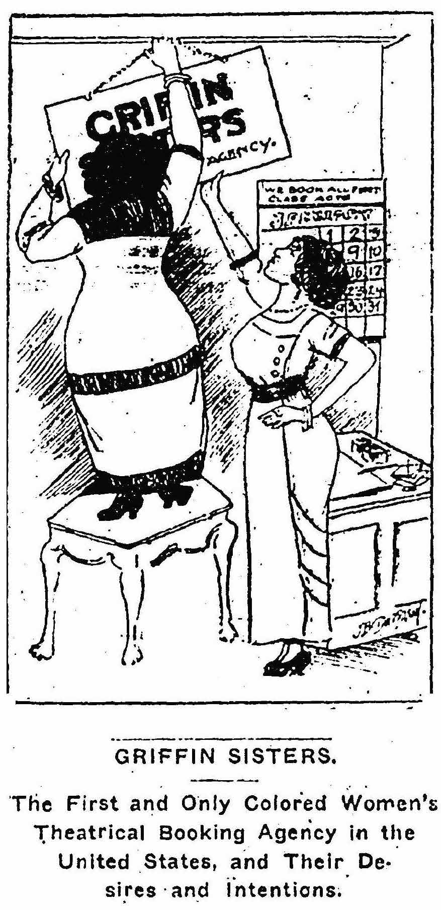

# **“Leadership as Community Service:  The Griffin Sisters, ‘The First and Only Colored Women’s Theatrical Booking Agency in the United States’”**

<h4 style="text-align: center;">Book Chapter, <em>Women's Innovations in Theater, Dance, Performance</em> (Bloomsbury)</h4>

Theatre scholars rarely engage with the work of booking agents and are even less inclined to call them leaders. By taking a feminist, race-conscious historiographical approach, this chapter defines theatrical booking as leadership and argues for its socio-political impact. It does so by excavating the work of vaudevillians Emma and Mabel Griffin, the first African American female booking agents in the United States. The Griffin Sisters started their agency in 1913 with no financial backing and despite the vaudeville industry was mostly controlled by a handful of white male managers. At the height of their performing careers, they renounced stage fame and fed their income as touring comedians into their agency by leasing several theatres in black communities around Chicago and Washington DC. By providing black artists with the employment fairness and stability that white vaudeville managers had failed to ensure, the Griffin Sisters made their agency a source of racial pride and an example of self-help. They redefined theatre booking as a leadership opportunity for black women and a service to the black community at large.
