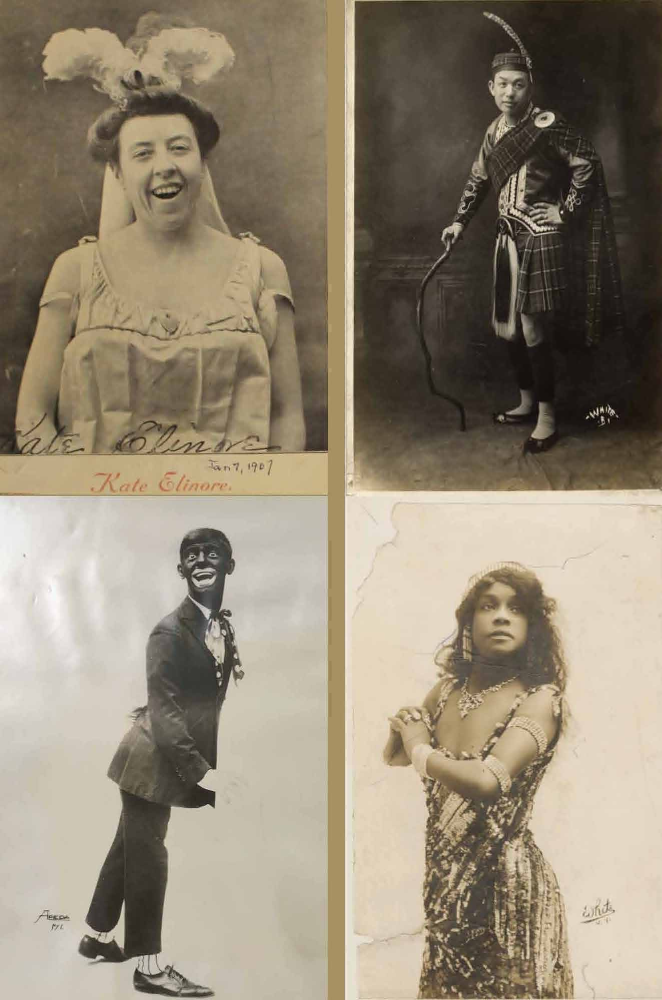

# ***Hyphen-Nation: Racial Impersonation and the Performance of Hyphenated Americanness***

My research explores how racial, ethnic, and national identity is made through performance. Specifically, I investigate instances wherein the performances of certain racialized groups expanded definitions of Americanness. In Hyphen-Nation, these performances are racial impersonations by hyphenated American entertainers of Irish, Asian, Jewish, and African descent between the end of the nineteenth and the beginning of the twentieth century. The book understands hyphenated impersonation as a performance tool for social critique and identity formation, and utilizes it to theorize hyphenation during the peak years of American immigration. I demonstrate how hyphenated impersonation established dynamic relationships between the different racial markers performed and the racialized identity of the performer. Due to this feature, I argue that hyphenated impersonation reveals hyphenation to also be a dynamic relational process rather than a fixed identity mark. Such a relationality, I claim, not only defines hyphenated subjects but is at the core of America as a nation. This America I call the “Hyphen-Nation:” not a nation of immigrants, as one might say, but a nation that depends on defining the relationality of the hyphen for its socio-political and conceptual configuration.

