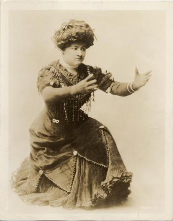

# **“Sophie Tucker, Racial Hybridity and Interracial Relations in American Vaudeville”**

<h4 style="text-align: center;"> <em>Theatre Research International</em> (July 2019)</h4>

<!--  -->

    

This article discusses Sophie Tucker's racialized performance in the context of early twentieth-century American vaudeville and black–Jewish interracial relations. Tucker's vaudeville musical acts involved mixed racial referents: ‘black-style’ music and dance, Jewish themes, Yiddish language and the collaboration of both African American and Jewish artists. I show how these racial combinations were a studied tactic to succeed in white vaudeville, a corporate entertainment industry that capitalized on racialized images and fast changes in characters. From historical records, it is clear that Tucker's black signifiers also fostered connections with the African American artists who inspired her work or were employed by her. How these interracial relations contended with Tucker's brand of racialized performance is the focus of the latter part of the article. Here I analyze Tucker's autobiography as a performative act, in order to reveal a reparative effort toward some of her exploitative approaches to black labor and creativity.

