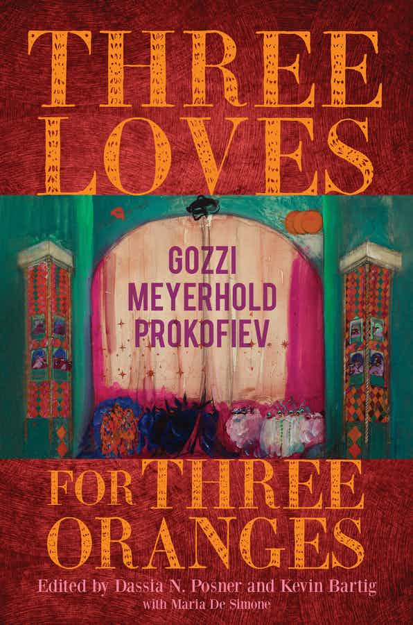

# ***Three Loves for Three Oranges:  Gozzi, Meyerhold, Prokofiev***

<h4 style="text-align: center;"> (Indiana University Press, 2021)</h4>

**Winner of the 2022 Society for Theatre Research Translation Prize and runner-up for best-edited collection prizes from the Association for Theatre in Higher Education and the Theatre and Performance Research Association.**

In 1921, Sergei Prokofiev’s Love for Three Oranges—one of the earliest, most famous examples of modernist opera—premiered in Chicago. Prokofiev's source was a 1913 theatrical divertissement by Vsevolod Meyerhold, who, in turn, took inspiration from Carlo Gozzi's 1761 commedia dell'arte–infused theatrical fairy tale. Only by examining these whimsical, provocative works together can we understand the full significance of their intertwined lineage. With contributions from 17 distinguished scholars in theater, art history, Italian, Slavic studies, and musicology, Three Loves for Three Oranges: Gozzi, Meyerhold, Prokofiev illuminates the historical development of Modernism in the arts, the ways in which commedia dell'arte's self-referential and improvisatory elements have inspired theater and music innovations, and how polemical playfulness informs creation. A resource for scholars and theater lovers alike, this collection of essays, paired with new translations of Love for Three Oranges, charts the transformations and transpositions that this fantastical tale underwent to provoke theatrical revolutions that still reverberate today.

