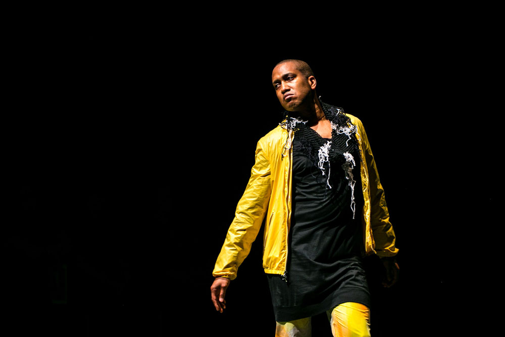

# **Bold Bodies:  Race in Feminist and Queer Performance**

This course defines minoritarian aesthetics in both content and style, underscoring the practices that remake the world from minor voices. This course understands theatre and performance as crucial for personal and community expression, political activism, and survival. We explore a variety of representation and performance techniques from the last sixty years—theatre and drama, modern dance, performance art, fashion, film, and music—from geographical areas including but not limited to the United States. Performances and theories spur discussions on topics such as body politics and sexualities, representation and spectatorship, understandings of race, and uses/limitations of performance in feminist/queer activism. 

###### (Image: ​​Trajel Harrell, *Twenty Looks or Paris is Burning at Judson Church*)
