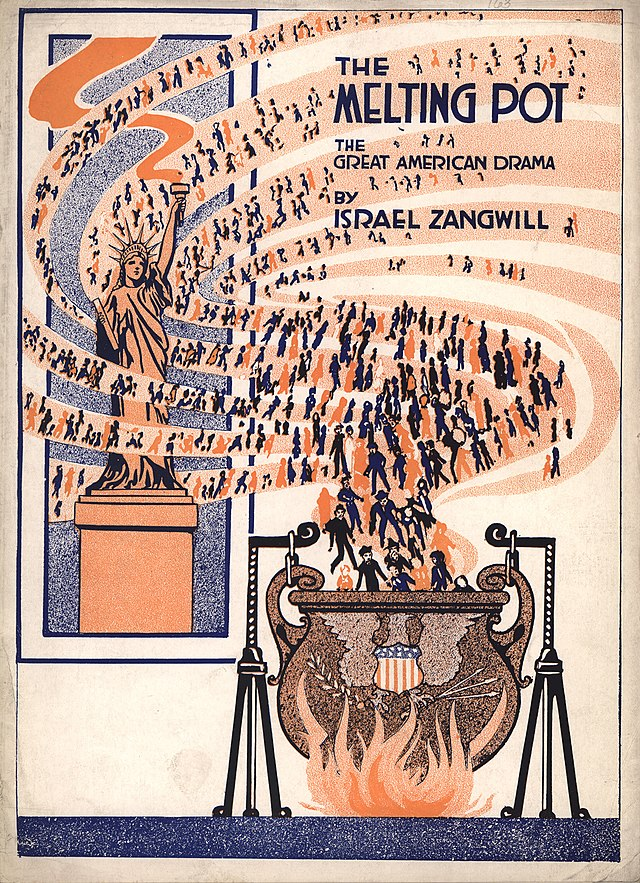

# **U.S. Immigrant Drama**

Through the reading and viewing of plays, students analyze how theatre illuminates cultural, racial, and legal perspectives on the immigrant experience in the United States. The course is organized chronologically, starting with the dramatic literature of the early twentieth century and concluding with the recent production (2023) of “Sanctuary City” by Martyna Majok. We explore stories by and about immigrants from Eastern Europe, Ireland, China, Japan, Cuba, Mexico, and Vietnam, among others. Discussions unpack how theatre reflects, challenges, and re-constructs the idea of the “American immigrant.” Topics include cultural appropriation, reclamation, and discovery; assimilation and passing; stereotyping and identity affirmation. In this course, theatre brings into view how identity dichotomies (foreign vs citizen, immigrant vs resident, first-generation vs second-generation, racial minority vs racial majority) have shaped immigrant subjectivities in the U.S. Ultimately, the plays we engage contest monolithic conceptions of the “immigrant” and the way in which foreignness and migration have impacted understandings of citizenship and racial belonging in the United States.

###### (Image: Theatre program for *The Melting Pot*, by Israel Zangwill, 1916, University of Iowa Libraries)
