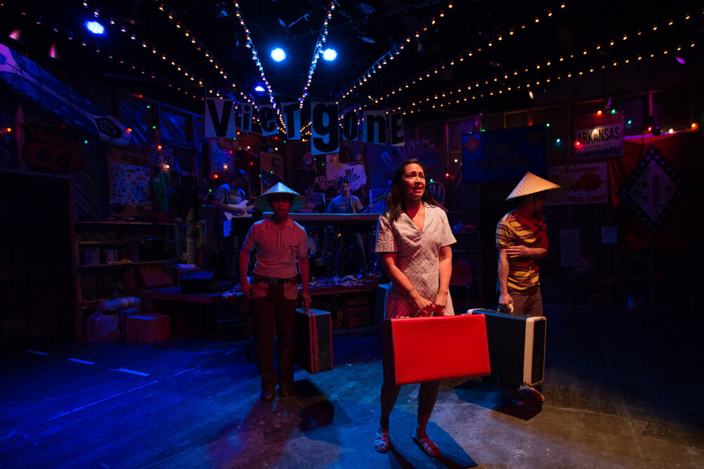

# **Contemporary American Drama:  The Immigrant Experience**

Through the reading and viewing of plays, students analyze how theatre illuminates cultural/racial perspectives on the contemporary immigrant experience in the United States. The course focuses on playwrights and directors of the last twenty years and on stories by and about recent immigrants from Cambodia, Vietnam, North Korea, Pakistan, Cuba, and Mexico, among others. Students consider how theatre can lead audiences to rediscover their heritage, exchange family and personal narratives, explore social issues of identity and diversity, and foster community engagement. Topics for discussion include cultural appropriation, reclamation, and discovery; assimilation and passing; stereotyping and identity affirmation.

###### (Image: *Vietgone*, Studio Theatre production (2018), directed by Natsu Onoda Power, Regina Aquino as Tang, set design by Tony Cisek) 